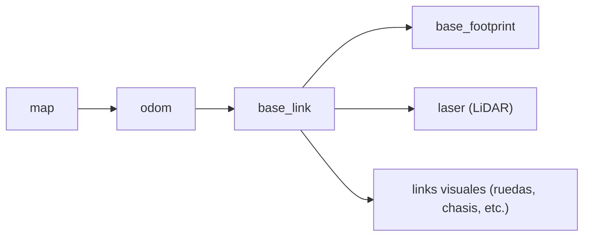

# Proyecto Final FRM — Robot LEGO EV3 + Raspberry Pi 5 con direccion tipo ackermann


https://youtube.com/shorts/OvnS0Iza-vA?si=ksYd9Vok_0_Z9SCn
https://youtube.com/shorts/rX5so5Xi6SM?si=RKQAg1PxmNvUryRc
https://youtube.com/shorts/TOCvV_U80M4?si=kjCOuEDGMjfBAXJw
https://youtu.be/-kdkcimfvvM?si=FcxcHx5Se8YGAp9K
https://youtu.be/-kdkcimfvvM?si=EzWeBxrMEHP7YW63

## 📑 Tabla de contenidos

1. [Visión general del sistema](#-visión-general-del-sistema)
2. [Arquitectura de hardware](#-arquitectura-de-hardware)
3. [Estructura del workspace](#-estructura-del-workspace)
4. [Paquete `mi_ackermann_bringup`](#-paquete-mi_ackermann_bringup)
5. [Paquete `mi_ackermann_description`](#-paquete-mi_ackermann_description)
6. [Paquete `mi_ackermann_hardware`](#-paquete-mi_ackermann_hardware)
7. [Otros paquetes del stack](#-otros-paquetes-del-stack)
8. [Árbol de transformadas (TF2)](#-árbol-de-transformadas-tf2)
9. [Odometría por láser — RF2O](#-odometría-por-láser--rf2o)
10. [SLAM — `slam_toolbox`](#-slam--slam_toolbox)
11. [Navegación — Nav2](#-navegación--nav2)
12. [Instalación y compilación](#-instalación-y-compilación)
13. [Comandos — flujos de trabajo completos](#-comandos--flujos-de-trabajo-completos)
14. [Resultados](#-resultados)
15. [Problemas conocidos y notas de depuración](#-problemas-conocidos-y-notas-de-depuración)
16. [Mejoras futuras](#-mejoras-futuras)

---

##  Visión general del sistema

El prototipo es un robot movil con dirección tipo ackermann.: una rueda trasera de tracción (motor grande del EV3) y una rueda delantera de dirección (motor pequeño del EV3) el prototipo  tiene 4 ruedas para estabilidad física, pero cinemáticamente se modela como carlike-bicicleta. Para el uso de ROS2 y la integracion con el lidar se usa la PI5 con ubuntu 24.04. la conexión entre estos elementos se detalla en el siguiente cuadro:

```
┌─────────────────────────────┐        WiFi / TCP:2100        ┌──────────────────────────────┐
│      LEGO Mindstorms EV3      │ <────────────────────────────> │        Raspberry Pi 5         │
│      (ev3dev / server.py)     │   "vel_pct,dir_deg\n"  (TX)    │           (ROS 2)             │
│  - Motor Large  → tracción    │   "pos,vel_pct,dir_deg\n" (RX) │                                │
│  - Motor Medium → dirección   │                                 │  ros2_control                 │
└─────────────────────────────┘                                 │   └─ AckermannHardware plugin  │
                                                                  │        └─ EV3Driver (socket)   │
        ┌───────────────────────────┐                            │  bicycle_steering_controller   │
        │   RPLiDAR C1 (USB/serial) │ ── /scan ───────────────►  │  robot_state_publisher (TF)    │
        └───────────────────────────┘                            │  rf2o_laser_odometry           │
                                                                   │  slam_toolbox / Nav2           │
        ┌───────────────────────────┐                            │  vision_analyzer (Gemini API)  │
        │  Cámara Logitech (USB)    │ ── /image_raw ──────────►  │                                │
        └───────────────────────────┘                            └──────────────────────────────┘
```

**Componentes físicos:**

| Componente | Función | Interfaz |
|---|---|---|
| **LEGO EV3 Brick** | Ejecuta `server.py`, controla los 2 motores, expone servidor TCP | WiFi (socket TCP, puerto `2100`) |
| Motor **Large** | Tracción (rueda trasera) | EV3 output (vía `server.py`) |
| Motor **Medium** | Dirección (rueda delantera, servo ±0.4 rad) | EV3 output (vía `server.py`) |
| **Raspberry Pi 5** | Corre todo el stack de ROS 2 (Humble/Jazzy) | — |
| **RPLiDAR C1** | Escaneo láser 2D para SLAM/Nav2 | USB serial (`/dev/ttyUSB0`) |
| **Cámara Logitech** | Captura de imagen para análisis de escena con IA | USB (`usb_cam` → `/image_raw`) |

---

## Arquitectura de hardware

### El puente EV3 ↔ Raspberry Pi

La comunicación entre la Raspberry Pi 5 y el EV3 **no usa ningún nodo ROS 2 intermedio**: el propio *hardware component* de `ros2_control` (`mi_ackermann_hardware`) abre y mantiene la conexión TCP en su ciclo de vida (`on_configure` → `driver_->init()`). Esto significa que **no hace falta lanzar nada aparte para "conectar" con el EV3** — el `controller_manager` se encarga solo al arrancar `ros2_control_node`.

**Protocolo TCP (texto plano, una línea por ciclo, definido en `ev3_driver.hpp`):**

| Dirección | Formato | Ejemplo | Significado |
|---|---|---|---|
| RPi5 → EV3 | `vel_traccion_pct,pos_direccion_deg\n` | `45.2,15.0\n` | Velocidad de tracción en % (-100 a 100) y ángulo de dirección en grados |
| EV3 → RPi5 | `pos_traccion_counts,vel_traccion_pct,pos_direccion_deg\n` | `1523,44.8,14.9\n` | Encoder de tracción (counts), velocidad real (%) y posición real de dirección (grados) |

**Conversión de unidades (motores EV3, 360 counts/rev):**

- `COUNTS_TO_RAD = 2π / 360`
- Motor **Large** (tracción): velocidad máx. ≈ **17.80 rad/s** (~170 RPM)
- Motor **Medium** (dirección): velocidad máx. ≈ **26.18 rad/s** (~250 RPM)
- La tracción se envía invertida (`RAD_S_TO_PCT_LARGE(-traction_cmd_rad_s_)`) por la orientación física del motor en el chasis.

**Parámetros de conexión** (definidos en el xacro `mobile_base.ros2_control.xacro`):

```xml
<plugin>mi_ackermann_hardware/AckermannHardware</plugin>
<param name="ip">192.168.0.110</param>
<param name="port">2100</param>
<param name="traction_type">large</param>
```

>  La IP del EV3 (`192.168.0.110`) y el puerto (`2100`) están **hardcodeados en el xacro** — si cambia la red o el EV3 obtiene otra IP, hay que actualizar `mobile_base.ros2_control.xacro` en `mi_ackermann_description` (referenciado explícitamente en `Cosas_importantes.txt` como el archivo "con la IP").

### Ciclo de vida del hardware component

`AckermannHardware` implementa la máquina de estados estándar de `ros2_control`:

| Estado | Acción |
|---|---|
| `on_init` | Lee `ip`, `port` y `traction_type` de los parámetros del URDF |
| `on_configure` | Crea el `EV3Driver` y abre el socket TCP (`UNCONFIGURED → INACTIVE`) |
| `on_activate` | Pone en cero todos los estados/comandos (`INACTIVE → ACTIVE`) |
| `read()` | Llama `driver_->sendAndReceive()`, actualiza posiciones/velocidades de los joints virtuales |
| `write()` | Envía al EV3 la velocidad de tracción y la posición de dirección deseadas |
| `on_deactivate` | Manda velocidad 0 y posición 0 antes de soltar el hardware |

### Interfaces expuestas a `ros2_control`

| Joint | Command interface | State interfaces |
|---|---|---|
| `virtual_front_wheel_joint` (dirección) | `position` | `position`, `velocity` |
| `virtual_rear_wheel_joint` (tracción) | `velocity` | `velocity`, `position` |

---

## 📂 Estructura del workspace

```
ros2_ws/
├── src/
│   ├── mi_ackermann_bringup/          # Launch files, configs de controladores, SLAM y Nav2
│   ├── mi_ackermann_description/      # URDF/xacro, ros2_control, Gazebo, mundo simulado
│   ├── mi_ackermann_description_viz/  # Paquete auxiliar solo para visualizar el URDF en RViz
│   ├── mi_ackermann_hardware/         # Hardware component (plugin ros2_control) que habla con el EV3
│   ├── rf2o_laser_odometry/           # Odometría por scan-matching láser (paquete de terceros integrado)
│   ├── sllidar_ros2/                  # Driver del RPLiDAR C1 (Slamtec)
│   └── vision_analyzer/               # Nodo Python: analiza /image_raw con Google Gemini
├── maps/                              # Mapas serializados (.data/.posegraph) y mapas ocupacionales (.pgm/.yaml)
├── Cosas_importantes.txt              # Bitácora de comandos de referencia del proyecto
└── frames_*.pdf / *.gv                # Salidas de `ros2 run tf2_tools view_frames`
```

---

## 🚀 Paquete `mi_ackermann_bringup`

Es el **paquete integrador**: no contiene lógica propia, sino los *launch files* y archivos de configuración (`.yaml`) que orquestan todos los demás paquetes para levantar el robot real, simularlo en Gazebo, mapear y navegar.

### Launch files

| Archivo | Propósito |
|---|---|
| **`carlikebot.launch.xml`** | El launch **principal para el robot real**. Levanta `ros2_control_node` con el plugin `AckermannHardware` (esto abre la conexión TCP con el EV3), `robot_state_publisher`, y hace *spawn* de `joint_state_broadcaster` + `bicycle_steering_controller`. Además publica 10 mensajes de velocidad casi-cero al arrancar (truco necesario para "despertar" la odometría del controlador). |
| **`carlikebot_gazebo.launch.xml`** | Equivalente para **simulación en Gazebo Harmonic**: procesa el xacro con `sim_mode:=true` (usa el plugin `gz_ros2_control/GazeboSimSystem` en vez del hardware real), levanta Gazebo con el mundo `my_world.sdf`, un `ros_gz_bridge` para el reloj de simulación, y hace *spawn* del robot y sus controladores. |
| **`carlikebot_remap.launch.xml`** | Variante de `carlikebot.launch.xml` que además publica una TF estática `map → odom` y un *relay* que remapea `/cmd_vel` (Twist genérico) hacia `/bicycle_steering_controller/reference` (TwistStamped), útil para integrarse con nodos externos que publiquen `Twist` plano. |
| **`full_bringup.launch.py`** | Launch **"todo en uno"** (Python) que integra `carlikebot.launch.xml` + TF estática láser configurable por argumentos + `sllidar_ros2` + `slam_toolbox` (mapping) + `teleop_twist_keyboard` en una ventana `xterm` aparte (necesario porque el teleop necesita foco de teclado propio). Expone argumentos como `use_keyboard`, `slam_params_file`, `serial_port`, `laser_frame_id`, y los 6 parámetros de la TF del láser (`lidar_tf_x/y/z/roll/pitch/yaw`). |

### Archivos de configuración (`config/`)

| Archivo | Usado por | Contenido |
|---|---|---|
| `carlikebot_controllers.yaml` | `ros2_control_node` (robot real) | `joint_state_broadcaster` + `bicycle_steering_controller` |
| `carlikebotgazebo_controllers.yaml` | `ros2_control_node` (Gazebo) | Misma estructura, para simulación |
| `bridge_config.yaml` | `ros_gz_bridge` | Puente de tópicos ROS↔Gazebo (solo `/clock`) |
| `mapper_params_online_async.yaml` | `slam_toolbox` | Parámetros de **mapeo en vivo** |
| `mapper_params_localization.yaml` | `slam_toolbox` | Parámetros de **localización sobre mapa guardado** |
| `slam_params.yaml` | `slam_toolbox` (usado por `full_bringup.launch.py`) | Config alternativa de SLAM |
| `nav2_params.yaml` | `nav2_bringup` | Stack completo de Nav2 (controller, planner, costmaps, AMCL, BT navigator, etc.) |

### Controlador `bicycle_steering_controller`

```yaml
bicycle_steering_controller:
  ros__parameters:
    traction_joints_names: ['virtual_rear_wheel_joint']
    steering_joints_names: ['virtual_front_wheel_joint']
    wheelbase: 0.15                 # distancia entre ejes (m)
    traction_wheel_radius: 0.02     # radio de rueda (m)
    reference_timeout: 2.0
    open_loop: false
    position_feedback: false
    base_frame_id: base_link
    odom_frame_id: odom
    enable_odom_tf: false           # la TF odom->base_link la publica RF2O, no este controlador
```

Este controlador del paquete `bicycle_steering_controller` (parte de `ros2_controllers`) es el que traduce comandos `TwistStamped` en `/bicycle_steering_controller/reference` a velocidad de tracción + ángulo de dirección, aplicando la cinemática de bicicleta con el `wheelbase` configurado.

> **Nota clave:** `enable_odom_tf` está en `false` porque **la odometría del controlador NO se usa para TF** — esa responsabilidad se delega a `rf2o_laser_odometry`, que calcula odometría por *scan matching* del LiDAR (mucho más precisa que la odometría de encoders del EV3, propensa a deslizamiento).

---

## 🧱 Paquete `mi_ackermann_description`

Contiene el modelo del robot en **xacro/URDF**, modular y reutilizable entre robot real, Gazebo y RViz.

### Jerarquía de archivos xacro

```
my_robot.urdf.xacro  (real)  ──┐
my_robotg.urdf.xacro (gazebo)──┤
                                ├─ common_propperties.xacro   (materiales/colores)
                                ├─ mobile_base.xacro          (links + joints físicos)
                                ├─ mobile_base.ros2_control.xacro  (bloque <ros2_control>)
                                └─ mobile_base.gazebo.xacro   (plugins de Gazebo)
```

### Geometría del chasis (`mobile_base.xacro`)

| Propiedad | Valor |
|---|---|
| Largo (`base_length`) | 0.35 m |
| Ancho (`base_width`) | 0.20 m |
| Alto (`base_height`) | 0.24 m |
| Distancia entre ejes (`wheelbase`) | 0.15 m |
| Radio de rueda (`wheel_radius`) | 0.02 m |
| Ancho de rueda (`wheel_len`) | 0.045 m |
| Límite de dirección | ±0.4 rad (≈ ±22.9°) |
| Radio de giro mínimo | `wheelbase / tan(0.4) ≈ 0.355 m` |

**Estructura de links:**

- `base_link` (link raíz, sin geometría — es el frame de referencia de `ros2_control`)
  - `base_footprint` (joint fijo, proyección al suelo)
  - `chassis_link` (caja visual/colisión, el "cuerpo" del robot)
    - `virtual_rear_wheel` (joint `continuous`, tracción — usada por `ros2_control`)
      - `rear_right_wheel` / `rear_left_wheel` (joints `continuous` con `mimic` sobre la rueda virtual, solo visuales)
    - `virtual_front_wheel` (joint `revolute` [-0.4, 0.4] rad, dirección — usada por `ros2_control`)
      - `front_right_wheel` / `front_left_wheel` (joints `revolute` con `mimic`, solo visuales)

Este diseño de "rueda virtual + ruedas reales en *mimic*" es el patrón estándar recomendado por `ros2_control` para modelar vehículos tipo bicycle/Ackermann: el controlador solo necesita comandar **2 joints** (uno de tracción, uno de dirección), y las 4 ruedas visuales siguen automáticamente ese movimiento sin necesitar lógica adicional.

### Modos de hardware (`mobile_base.ros2_control.xacro`)

El bloque `<ros2_control>` soporta 3 modos intercambiables vía el argumento `hardware_type`:

```xml
<xacro:if value="${hardware_type == 'mock'}">
  <plugin>mock_components/GenericSystem</plugin>          <!-- pruebas sin hardware -->
</xacro:if>
<xacro:if value="${hardware_type == 'gazebo'}">
  <plugin>gz_ros2_control/GazeboSimSystem</plugin>          <!-- simulación -->
</xacro:if>
<xacro:if value="${hardware_type == 'real'}">
  <plugin>mi_ackermann_hardware/AckermannHardware</plugin>  <!-- EV3 real -->
  <param name="ip">192.168.0.110</param>
  <param name="port">2100</param>
  <param name="traction_type">large</param>
</xacro:if>
```

### Mundo de simulación

`world/my_world.sdf` y `world/empty.sdf` son los entornos SDF usados por `carlikebot_gazebo.launch.xml` para probar el robot en Gazebo Harmonic sin depender del hardware físico.

---

## ⚙️ Paquete `mi_ackermann_hardware`

Es el **plugin `pluginlib` de `ros2_control`** que materializa la conexión con el mundo real. Se compila como librería C++ y se declara en `mi_ackermann_hardware.xml` para que `ros2_control_node` pueda cargarlo dinámicamente por nombre (`mi_ackermann_hardware/AckermannHardware`).

**Archivos clave:**

- `include/mi_ackermann_hardware/ackermann_hardware_interface.hpp` — declaración de la clase `AckermannHardware : public hardware_interface::SystemInterface`
- `src/ackermann_hardware_interface.cpp` — implementación del ciclo de vida (`on_init`, `on_configure`, `on_activate`, `read`, `write`, `on_deactivate`)
- `include/mi_ackermann_hardware/ev3_driver.hpp` — clase `EV3Driver`, encapsula el socket TCP POSIX y la conversión de unidades EV3 ↔ ROS 2

Este diseño desacopla completamente el protocolo EV3 (sockets, texto plano, counts/porcentajes) del resto del stack ROS 2, que solo ve interfaces estándar de `hardware_interface` (`position`, `velocity` en rad y rad/s).

---

## 🧩 Otros paquetes del stack

### `rf2o_laser_odometry`
Paquete de terceros (integrado como *source* dentro del workspace) que calcula **odometría 2D por scan-matching** directamente del `/scan` del LiDAR, sin depender de encoders. Publica el tópico `/odometry` y la TF `odom → base_link`. Es la fuente de odometría real del sistema (en vez de `bicycle_steering_controller`, cuyo `enable_odom_tf` está deshabilitado).

### `sllidar_ros2`
Driver oficial de Slamtec para la familia RPLiDAR, usado aquí con el modelo **C1**. Se lanza con `sllidar_c1_launch.py` y publica `/scan` (`sensor_msgs/LaserScan`) en el frame configurado (`laser` o `laser_frame` según el modo de TF elegido).

### `vision_analyzer`
Nodo Python (`image_analyze.py`) que:
- Se suscribe a `/image_raw` (imagen de la cámara Logitech, publicada típicamente por `usb_cam`).
- Expone un servicio `/analyze_scene` (`std_srvs/Trigger`).
- Al ser invocado, envía la última imagen capturada a la **API de Google Gemini** (`google-genai`), pidiendo una clasificación de escena en JSON (`tipo_lugar`, `descripcion`).
- Publica el resultado en `/scene_analysis` (`std_msgs/String`).
- Requiere `GEMINI_API_KEY` como variable de entorno o parámetro `api_key`.

Este nodo le da al robot una capacidad de **percepción semántica de alto nivel** (por ejemplo, reconocer si está en una tienda, panadería, oficina, etc.), complementaria al mapeo geométrico del LiDAR.

### `mi_ackermann_description_viz`
Paquete "gemelo" ligero de `mi_ackermann_description`, pensado exclusivamente para **visualizar el URDF en RViz** (`display.launch.xml` + `rviz/urdf_config.rviz`) sin necesitar `ros2_control`, hardware ni Gazebo — útil para revisar rápidamente la geometría del robot o depurar el xacro.

---

## Árbol de transformadas (TF2)

La cadena de transformadas del sistema, de arriba hacia abajo, es:



| Transformada | Publicada por | Naturaleza |
|---|---|---|
| `map → odom` | `slam_toolbox` (modo *mapping*) o `amcl` (modo *localization* con mapa fijo) | Corrección de deriva mediante scan matching / filtro de partículas |
| `odom → base_link` | `rf2o_laser_odometry` | Odometría continua por scan-matching láser |
| `base_link → laser` | `tf2_ros static_transform_publisher` (manual) **o** `robot_state_publisher` (si el link está en el xacro) | Extrínsecos fijos del montaje del LiDAR |
| `base_link → chassis_link → ruedas` | `robot_state_publisher` | Cinemática del URDF |

### Comando de TF estática del láser

El valor exacto depende de dónde quedó montado físicamente el RPLiDAR C1 respecto al `base_link`. En el proyecto se usaron **dos calibraciones distintas** a lo largo del desarrollo:

```bash
# Calibración con inclinación (pitch) — primeras pruebas
ros2 run tf2_ros static_transform_publisher 0.025 0.06 0.017 0 -0.087 1.5708 base_link laser

# Calibración final usada en el flujo de mapeo/navegación (sin inclinación)
ros2 run tf2_ros static_transform_publisher 0.025 0.06 0.17 0 0 0 base_link laser
```

La segunda ofrece una ventaja importante y es la alineación automatica entre los marcos de referencia.

Formato: `x y z yaw pitch roll parent_frame child_frame` (sintaxis posicional legacy de `static_transform_publisher`). En `full_bringup.launch.py` esto se hace de forma más robusta con argumentos explícitos `--x --y --z --roll --pitch --yaw` para evitar confundir el orden roll/pitch/yaw.

### Generar el árbol de TF (`view_frames`)

```bash
ros2 run tf2_tools view_frames
# genera frames_<timestamp>.pdf y frames_<timestamp>.gv en el directorio actual
```

---

## Odometría por láser — RF2O

La odometria de las ruedas, presenta complicaciones a la hora de generarla, debido a problemas de ruido y presición el marco de odometria saltaba constantemente, generando problemas constantes en el **SLAM** y en la **navegación**, debido a esto se planteo el uso de otro tipo de fuentes para una toma de odometria, entre ellas, se valoro el uso de sensor `IMU`, `Laser Scan Matcher` y `rf2o_laser_odometry`, de las cuales, se selecciono `rf2o_laser_odometry` para reemplazar a la odometría por encoders del EV3 (más ruidosa, con deslizamiento de ruedas pequeñas) por una **odometría basada en scan-matching** entre escaneos consecutivos del LiDAR, debido a que es la que mejor resultados ofrece.

**Configuración (`rf2o_laser_odometry.launch.py`):**

```python
parameters=[{
    'laser_scan_topic': '/scan',
    'odom_topic':       '/odometry',
    'publish_tf':       True,
    'base_frame_id':    'base_link',
    'odom_frame_id':    'odom',
    'init_pose_from_topic': '',
    'freq': 10.0,
}]
```

Al tener `publish_tf: True`, este nodo es el responsable directo de la transformada `odom → base_link`, corriendo a 10 Hz — la frecuencia con la que se actualiza la posición estimada del robot entre reajustes de SLAM/AMCL sobre `map → odom`.

---

## SLAM — `slam_toolbox`

El proyecto usa **`slam_toolbox` en modo asíncrono** (`online_async_launch.py`), con dos archivos de parámetros según la fase:

### Modo *mapping* — `mapper_params_online_async.yaml`

Usado durante el **mapeo en vivo** (teleoperado con teclado). Puntos clave:

```yaml
mode: mapping
odom_frame: odom
map_frame: map
base_frame: base_link
scan_topic: /scan
resolution: 0.05
max_laser_range: 20.0
minimum_travel_distance: 0.5
minimum_travel_heading: 0.5
do_loop_closing: true
solver_plugin: solver_plugins::CeresSolver
```

El solver **Ceres** (con `SPARSE_NORMAL_CHOLESKY` + `LEVENBERG_MARQUARDT`) se encarga de la optimización de grafo de poses (*pose graph SLAM*), incluyendo **cierre de bucles** (`do_loop_closing: true`) cuando el robot vuelve a pasar por una zona ya mapeada.

### Modo *localization* — `mapper_params_localization.yaml`

Copia del anterior con dos cambios para **localizarse sobre un mapa ya guardado** en vez de construir uno nuevo:

```yaml
mode: localization
map_file_name: ~/ros2_ws/maps/soyelmapa2.yaml
```

### Guardar el mapa (serialización)

Desde el plugin **SLAM Toolbox** en RViz2:

> Botón derecho en el panel **"Slam Toolbox"** → **Serialize Map** → asignar un nombre (ej. `mapa_nuevo`) → se guarda como `maps/mapa_nuevo.data` y `maps/mapa_nuevo.posegraph`.

Este proyecto incluye varios mapas ya generados como evidencia de las pruebas de mapeo:

| Archivo | Tipo |
|---|---|
| `Mapa_original.data` / `.posegraph` | Mapa serializado (grafo de poses de SLAM Toolbox) |
| `mapa_serial.data` / `.posegraph` | Segunda captura de mapeo serializado |
| `maps/soyelmapa.yaml` + `soyelmapa.pgm` | Mapa de ocupación exportado (formato estándar `map_server`, usado por Nav2) |
| `maps/soyelmapa2.pgm` | Variante usada como `map_file_name` en `mapper_params_localization.yaml` |

---

## Navegación — Nav2

El stack de Nav2 (`nav2_params.yaml`) está **específicamente calibrado para la cinemática bicycle/Ackermann** del robot, no para un robot diferencial genérico. Parámetros derivados de la geometría real:

```
wheelbase        = 0.15 m
wheel_radius     = 0.02 m
ancho (footprint)= 0.20 m  → ±0.10 m en Y
largo (footprint)= 0.35 m  → ±0.175 m en X
alto             = 0.24 m
vel. máx/mín     = ±0.2 m/s   (el robot SÍ puede ir en reversa)
radio de giro mín= wheelbase / tan(0.4 rad) ≈ 0.355 m
```

### Planificador global — `SmacPlannerHybrid`

```yaml
GridBased:
  plugin: "nav2_smac_planner::SmacPlannerHybrid"
  minimum_turning_radius: 0.231
  motion_model_for_search: "REEDS_SHEPP"   # permite tramos en reversa
  allow_unknown: true
```

Se eligió **Reeds-Shepp** (en vez de Dubins) precisamente porque el robot puede retroceder, permitiendo rutas más cortas/factibles en espacios reducidos.

### Controlador local — `RegulatedPurePursuitController`

```yaml
FollowPath:
  plugin: "nav2_regulated_pure_pursuit_controller::RegulatedPurePursuitController"
  desired_linear_vel: 0.2
  use_rotate_to_heading: false   # el robot NO puede girar en el sitio
  allow_reversing: true
  lookahead_dist: 0.4
```

`use_rotate_to_heading: false` es obligatorio: a diferencia de un robot diferencial, este vehículo **no puede rotar sobre su propio eje**, por lo que Pure Pursuit debe seguir la trayectoria puramente por curvatura.

### Costmaps

- **Local costmap**: `rolling_window` 3×3 m, capa `voxel_layer` + `inflation_layer`, alimentada por `/scan`.
- **Global costmap**: capas `static_layer` (mapa fijo) + `obstacle_layer` + `inflation_layer`.
- El *footprint* real del robot (`[[0.175,0.10],[0.175,-0.10],[-0.175,-0.10],[-0.175,0.10]]`) se usa en ambos costmaps.

### AMCL

```yaml
amcl:
  robot_model_type: "nav2_amcl::DifferentialMotionModel"
  max_particles: 2000
  min_particles: 500
  set_initial_pose: false   # se define a mano con "2D Pose Estimate" en RViz
```

### `collision_monitor` — el "puente" de velocidades

Un detalle particular de esta integración: Nav2 internamente publica velocidades en `cmd_vel_smoothed`, pero el robot espera comandos en `/bicycle_steering_controller/reference`. El `collision_monitor` se usa como **remapeador nativo**:

```yaml
collision_monitor:
  ros__parameters:
    cmd_vel_in_topic: "cmd_vel_smoothed"
    cmd_vel_out_topic: "/bicycle_steering_controller/reference"
    enable_stamped_cmd_vel: true
    polygons: ["PolygonStop"]
```

Así, el `collision_monitor` no solo vigila colisiones inminentes con el polígono de seguridad (`PolygonStop`), sino que también actúa como el nodo final que efectivamente mueve al robot.

---

## Instalación y compilación

```bash
# 1. Clonar/copiar el workspace
cd ~/ros2_ws

# 2. Instalar dependencias declaradas en los package.xml
rosdep install --from-paths src --ignore-src -r -y

# 3. Compilar todo el workspace
colcon build --symlink-install

# 4. Origin del entorno
source install/setup.bash
```

**Dependencias externas relevantes (no incluidas como fuente, deben estar instaladas en el sistema):**
- `ros2_control`, `ros2_controllers` (incluye `bicycle_steering_controller`)
- `slam_toolbox`
- `nav2_bringup` y el resto del stack `navigation2`
- `teleop_twist_keyboard`
- `usb_cam` (para publicar `/image_raw` desde la cámara Logitech)
- `gz_ros2_control`, `ros_gz_sim`, `ros_gz_bridge` (solo si se usa el flujo de simulación en Gazebo)
- Librería Python `google-genai` (para `vision_analyzer`)

---

## Comandos — flujos de trabajo completos

### 0. Comandos sueltos de referencia

```bash
# Teleoperación remapeada al controlador tipo bicicleta (TwistStamped)
ros2 run teleop_twist_keyboard teleop_twist_keyboard \
  --ros-args -p stamped:=true --remap cmd_vel:=/bicycle_steering_controller/reference

# TF estática base_link -> laser (calibración final)
ros2 run tf2_ros static_transform_publisher 0.025 0.06 0.17 0 0 0 base_link laser
```

---

### 1. MAPEO manual con teclado (SLAM online)

Abrir **7 terminales**, todas con el workspace *sourced* (`source install/setup.bash`):

```bash
# Terminal 1 — Robot + controladores (abre conexión TCP con el EV3)
ros2 launch mi_ackermann_bringup carlikebot.launch.xml

# Terminal 2 — TF estática del láser
ros2 run tf2_ros static_transform_publisher 0.025 0.06 0.17 0 0 0 base_link laser

# Terminal 3 — LIDAR
ros2 launch sllidar_ros2 sllidar_c1_launch.py

# Terminal 4 — Odometría por láser (publica odom -> base_link)
ros2 launch rf2o_laser_odometry rf2o_laser_odometry.launch.py

# Terminal 5 — SLAM en modo mapping
ros2 launch slam_toolbox online_async_launch.py \
  params_file:=./src/mi_ackermann_bringup/config/mapper_params_online_async.yaml \
  use_sim_time:=false

# Terminal 6 — Teleoperación por teclado
ros2 run teleop_twist_keyboard teleop_twist_keyboard \
  --ros-args -p stamped:=true \
  --remap cmd_vel:=/bicycle_steering_controller/reference

# Terminal 7 — RViz para visualizar el mapa en construcción
rviz2
```

Para **guardar el mapa**: en el plugin *Slam Toolbox* de RViz → botón derecho → **Serialize Map** → nombre (ej. `mapa_nuevo`) → se guarda en `maps/mapa_nuevo.data` y `maps/mapa_nuevo.posegraph`.


---

### 2. NAVEGACIÓN AUTÓNOMA sobre mapa guardado (SLAM localization + Nav2)

**Paso previo:** crear `mapper_params_localization.yaml` a partir de `mapper_params_online_async.yaml` cambiando:
- `mode: mapping` → `mode: localization`
- Descomentar / apuntar `map_file_name` al mapa serializado (`.data`) guardado en el paso anterior.

```bash
# Terminal 1 — Robot + controladores
ros2 launch mi_ackermann_bringup carlikebot.launch.xml

# Terminal 2 — TF láser
ros2 run tf2_ros static_transform_publisher 0.025 0.06 0.17 0 0 0 base_link laser

# Terminal 3 — LIDAR
ros2 launch sllidar_ros2 sllidar_c1_launch.py

# Terminal 4 — Odometría láser
ros2 launch rf2o_laser_odometry rf2o_laser_odometry.launch.py

# Terminal 5 — slam_toolbox en modo localización, reutilizando el mapa
ros2 launch slam_toolbox online_async_launch.py \
  params_file:=./src/mi_ackermann_bringup/config/mapper_params_localization.yaml \
  use_sim_time:=false

# Terminal 6 — Nav2 (planificación + control)
ros2 launch nav2_bringup bringup_launch.py \
  params_file:=./src/mi_ackermann_bringup/config/nav2_params.yaml \
  slam:=False \
  use_localization:=False \
  autostart:=True \
  use_composition:=False

# Terminal 7 — RViz (dar "2D Nav Goal" para enviar destinos)
rviz2
```

---

### 3. NAVEGACIÓN con AMCL sobre mapa fijo (`map_server` + `amcl`)

Variante más clásica de Nav2, usando el `.yaml`/`.pgm` exportado (`maps/soyelmapa.yaml`) en vez de re-usar `slam_toolbox`:

```bash
ros2 launch mi_ackermann_bringup carlikebot.launch.xml
ros2 run tf2_ros static_transform_publisher 0.025 0.06 0.17 0 0 0 base_link laser
ros2 launch sllidar_ros2 sllidar_c1_launch.py
ros2 launch rf2o_laser_odometry rf2o_laser_odometry.launch.py

ros2 launch nav2_bringup bringup_launch.py \
  params_file:=./src/mi_ackermann_bringup/config/nav2_params.yaml \
  map:=~/ros2_ws/maps/soyelmapa.yaml \
  slam:=False \
  autostart:=True \
  use_composition:=False

rviz2
# En RViz: usar "2D Pose Estimate" para inicializar AMCL, luego "2D Nav Goal"
```

---

### 4. Análisis de escena con visión (cámara Logitech + Gemini)

```bash
# Publicar la cámara Logitech como /image_raw
ros2 run usb_cam usb_cam_node_exe

# Lanzar el analizador (requiere GEMINI_API_KEY en el entorno)
export GEMINI_API_KEY="tu_api_key"
ros2 run vision_analyzer image_analyze

# Disparar un análisis puntual
ros2 service call /analyze_scene std_srvs/srv/Trigger {}

# Escuchar los resultados
ros2 topic echo /scene_analysis
```

---

### 5. Todo en uno (launch integrado)

```bash
ros2 launch mi_ackermann_bringup full_bringup.launch.py \
  use_keyboard:=true \
  serial_port:=/dev/ttyUSB0 \
  use_manual_lidar_tf:=true
```

### 6. Simulación en Gazebo (sin hardware real)

```bash
ros2 launch mi_ackermann_bringup carlikebot_gazebo.launch.xml
```

### 7. Inspeccionar el árbol de TF en cualquier momento

```bash
ros2 run tf2_tools view_frames
```

---

## Resultados

### Árbol de TF (`view_frames`)

Resultado real generado con `ros2 run tf2_tools view_frames` durante una sesión de mapeo, mostrando la cadena completa `map → odom → base_link → {base_footprint, laser}`:


> *Espacio para complementar con capturas adicionales de `view_frames` en distintas etapas (solo bringup, con SLAM activo, con Nav2 activo) si se desea comparar la evolución del árbol de transformadas.*

---


### Video — Mapeo con SLAM (teleoperado)

Video del proceso de mapeo en vivo, mostrando el crecimiento del mapa en RViz mientras el robot es teleoperado con teclado (flujo de la sección [1. MAPEO manual con teclado](#-1-mapeo-manual-con-teclado-slam-online)):


<a href="https://www.youtube.com/watch?v=-kdkcimfvvM">

</a>


<a href="https://www.youtube.com/watch?v=TS5ZrMfOJ-s">

</a>

---

### Video — Navegación con generación de mapa en vivo (SLAM + Nav2)

Video de navegación autónoma mientras `slam_toolbox` sigue actualizando el mapa en tiempo real (flujo de la sección [2. NAVEGACIÓN AUTÓNOMA sobre mapa guardado](#-2-navegación-autónoma-sobre-mapa-guardado-slam-localization--nav2)):

<a href="https://www.youtube.com/shorts/TOCvV_U80M4">

</a>
---


## Problemas conocidos y notas de depuración

Estas notas están documentadas directamente en el código y en la bitácora del proyecto (`Cosas_importantes.txt` y comentarios en los launch files):

- **Doble publicador de la misma TF:** nunca activar `use_manual_lidar_tf` a la vez que el xacro define el link del láser — genera un "salto" continuo en la transformada `base_link → laser`. Mismo riesgo si `enable_odom_tf` del `bicycle_steering_controller` se activa a la vez que RF2O publica `odom → base_link`.
- **`teleop_twist_keyboard` necesita foco de teclado propio:** al lanzarlo dentro de un `launch` normal en background, el nodo arranca pero nunca "ve" las teclas presionadas en otra ventana — por eso `full_bringup.launch.py` lo abre en su propia `xterm`.
- **Velocidad cero inicial:** los launch de `carlikebot` publican 10 mensajes de velocidad casi-cero (`0.001 m/s`) 3 segundos después de arrancar — un truco necesario para inicializar correctamente la odometría del controlador tras el *spawn*.
- **AMCL sin modelo Ackermann nativo:** se usa `DifferentialMotionModel` como aproximación, válida solo a baja velocidad (±0.2 m/s en este robot).
- **`enable_stamped_cmd_vel`** debe estar activo consistentemente en `controller_server`, `behavior_server`, `velocity_smoother` y `collision_monitor` — de lo contrario hay conflictos de tipo de mensaje (`Twist` vs `TwistStamped`) en el tópico `cmd_vel`.
- **IP del EV3 hardcodeada:** si el EV3 cambia de IP (DHCP), hay que actualizar manualmente `mobile_base.ros2_control.xacro` en `mi_ackermann_description` y recompilar/reinstalar ese paquete.

---
